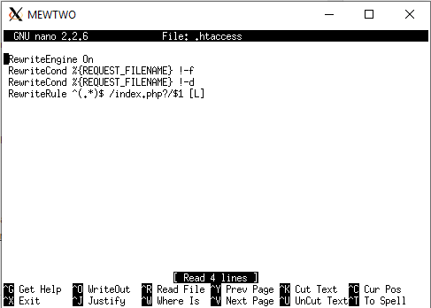
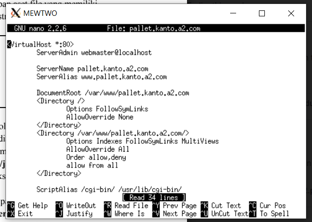
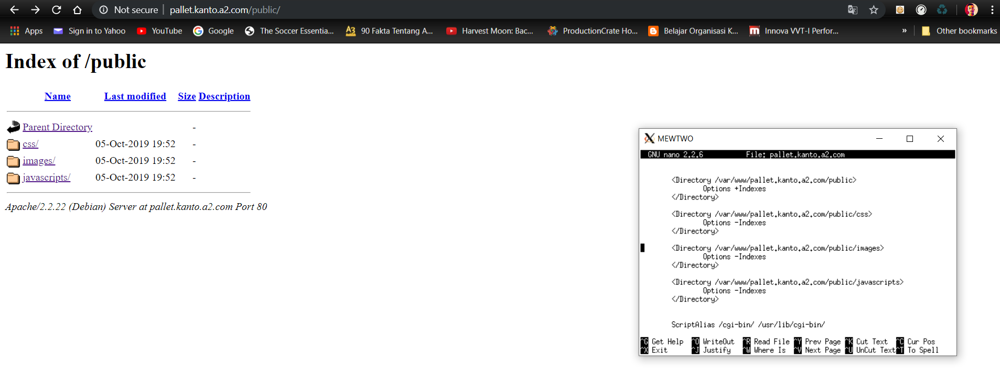
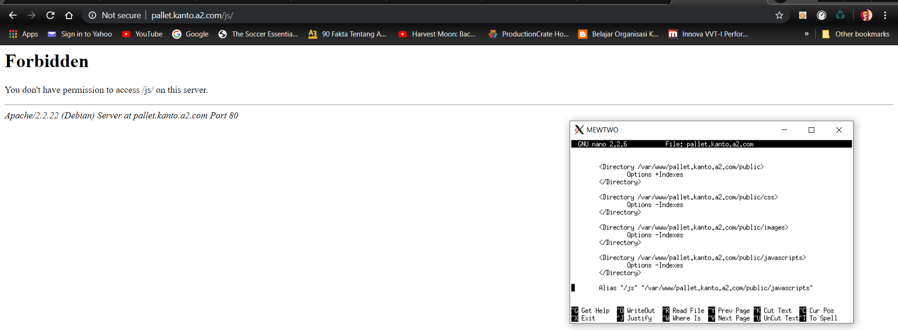

# Lapres_Modul2_JA02
Laporan Praktikum Jaringan Komputer 2019 oleh grup A02.

### Oleh:
- Donny Fitrado (05111740000171)
- Faqih Fathan Irfani (05111740000175)

## Membuat File topologi.sh
Pertama, kita akan membuat file topologi.sh seperti berikut ini:


## Menghilangkan (#) dari bagian net.ipv4.ip_forward=1
Kedua, buka file ```sysctl.conf``` pada directory etc di ARTICUNO.

<br /> Kemudian, ketikkan ```sysctl -p``` untuk mengaktifkan perubahan.

## Setting IP di Semua UML
Buka file interfaces dengan mengetikkan ```nano /etc/network/interfaces```, lalu isi semua UML dengan IP yang ada di bawah ini:
### Pikachu (Router)
```
auto eth0
iface eth0 inet static
address 10.151.72.18
netmask 255.255.255.252
gateway 10.151.72.17

auto eth1
iface eth1 inet static
address 10.151.73.33
netmask 255.255.255.248

auto eth2
iface eth2 inet static
address 192.168.0.1
netmask 255.255.255.0
```
### Articuno (DNS Server)
```auto eth0
iface eth0 inet static
address 10.151.73.34
netmask 255.255.255.248
gateway 10.151.73.33
```
### Mewtwo (Web Server)
```
auto eth0
iface eth0 inet static
address 10.151.73.35
netmask 255.255.255.248
gateway 10.151.73.33
```
### Moltres (DNS Slave)
```
auto eth0
iface eth0 inet static
address 10.151.73.36
netmask 255.255.255.248
gateway 10.151.73.33
```
### Psyduck (Klien)
```
auto eth0
iface eth0 inet static
address 192.168.0.2
netmask 255.255.255.0
gateway 192.168.0.1
```
### Snorlax (Klien)
```
auto eth0
iface eth0 inet static
address 192.168.0.3
netmask 255.255.255.0
gateway 192.168.0.1
```

Setelah semua UML diberi IP, maka restart network dengan ```service networking restart```

## Membuat file iptables.h
Kita membuat file iptables.h yang berisi ```iptables -t nat -A POSTROUTING -o eth0 -j MASQUERADE -s 192.168.0.0/16```
seperti di bawah ini: <br />

<br /> Pembuatan file ini kita lakukan agar lebih cepat menjalankan iptables(dengan dibash), daripada mengetik satu per satu setiap kita ingin menjalankan iptables.

## Membuat file proxy.sh
Lalu, membuat file proxy.sh yang berisi template proxy (sudah diberikan di soal) namun kita sesuaikan dengan proxy yang kita dapatkan dari OTP integra. <br />


## Jalankan iptables dan proxy
```bash iptables.h``` pada PIKACHU, lalu ```source proxy.sh``` pada semua UML. <br />


## Menginstall bind9
Pertama, kita mengupdate package list terlebih dahulu dengan ```apt-get update```
Setelah itu, barulah menginstall bind9 dengan ```apt-get install bind9 -y``` seperti di bawah ini: <br />


# Jawaban Soal
## NO1 
Membuat alamat domain kanto.a2.com dengan cara mengkonfigurasi pada /etc/bind/named.conf.local seperti di bawah ini: <br />


Lalu, buat folder dengan ```mkdir /etc/bind/jarkom```. Copy file db.local ``` /etc/bind/db.local /etc/bind/jarkom/kanto.a2.com```
Buka file kanto.a2.com lalu ubah ```localhost``` dengan ```kanto.a2.com``` serta menambahkan IP mewtwo seperti di bawah ini:
```
@       IN      A       10.151.73.27
```

Kemudian, tambahkan nameserver pada ```/etc/resolv.conf``` seperti:
```
nameserver 10.151.73.28 // IP MOLTRES
nameserver 10.151.73.26 // IP ARTICUNO
```
Jangan lupa untuk save file ketika selesai membuat konfigurasi.

## NO2
Membuat alias ```www.kanto.a2.com``` dengan menggunakan CNAME pada file ```/etc/bind/jarkom/kanto.a2.com``` seperti di bawah ini:
```
www     IN      CNAME       kanto.a2.com
```

## NO3
Membuat subdomain ```http://www.pallet.kanto.a2.com``` yang DNS nya diatur oleh ARTICUNO, dan mengarah ke MEWTWO. Kita hanya perlu menambahkan ```www.pallet``` pada file ```/etc/bind/jarkom/kanto.a2.com``` :
```
www.pallet      IN      A       10.151.73.27  //IP MEWTWO
```

## NO4
Membuat Reverse Domain dengan mengedit di UML ARTICUNO ```nano /etc/bind/named.conf.local``` dengan menambahkan ```zone 73.151.10.in-addr.arpa``` seperti ini: <br />

Tapi sayangnya tidak dapat berjalan pada UML kami, sering kali tertulis ```does not have record``` dan sebagainya.

## NO5
Mengimplementasikan MOLTRES sebagai DNS Slave dengan cara:

## NO6
Subdomain ```http://pewter.kanto.a2.com``` yang didelegasikan di MOLTRES dan diarahkan ke MEWTWO

## NO7
Membuat subdomain ```http://vermilion.pewter.kanto.a2.com``` dengan mengedit file ```pewter.kanto.a2.com```  seperti:
```
vermillion      IN      A       10.151.73.27 // IP MEWTWO
```

## NO8
Pengaturan webserver domain ```http://kanto.a2.com``` mempunyai DocumentRoot pada ```/var/www/kanto.a2.com```. Kita dapat melakukannya dengan mengedit file ```/etc/apache2/sites-available/default``` seperti di bawah ini: <br />

<br />Namun apabila belum bisa berjalan, kita bisa menginstall apache2 dengan ```apt-get install apache2``` pada UML MEWTWO dan juga menginstall php5 dengan ```apt-get install php5```.

Kemudian, membuat directory website dengan ```mkdir /var/www/kanto.a2.com```. Pindah ke direktori /etc/apache2/sites-available dan copy file default ke file kanto.a2.com (``` cp default kanto.a2.com```). Setelah itu, edit file ```kanto.a2.com```. Begitu selesai, aktifkan konfigurasi dengan ```a2ensite kanto.a2.com```. Barulah mengganti DNS pada komputer dengan IP ARTICUNO seperti ini: <br />

<br /> Jangan lupa untuk mengunduh file pendukung dengan wget 10.151.36.234/kanto.com.zip di directory /var/www/kanto.a2.com. Extract file setelah file zip didownload.
<br />
Tampilan ```kanto.a2.com``` ketika dibuka di browser: <br />


## NO9
Menggunakan rewrite agar ```http://kanto.a2.com/index.php/home``` bisa diakses hanya dengan ```http://kanto.a2.com/home```
Lalu kita aktifkan module rewrite ```a2enmod rewrite``` dan pindah ke directory ```/var/www/kanto.a2.com``` dan buat file .htaccess dengan isi: <br />

<br />
Kemudian buka ```/etc/apache2/sites-available/kanto.a2.com``` lalu tambahkan:
```
<Directory /var/www/kanto.a2.com>
    Options +FollowSymLinks -Multiviews
    AllowOverride All
</Directory>
```

 
 ## NO10
 Membuat domain ```http://www.pallet.kanto.a2.com``` untuk menyimpan file dengan DocumentRoot ```/var/www/pallet.kanto.a2.com```
 Kita bisa membuat directory terlebih dahulu dengan ```mkdir /var/www/pallet.kanto.a2.com```. Lalu copy file default yang ada pada ```/etc/sites-available/default``` ke file ```pallet.kanto.a2.com```. Setelah itu, baru edit file ```pallet.kanto.a2.com``` seperti ini: <br />
 
 
<br /> Lalu, aktifkan konfigurasi dengan perintah ```a2ensite pallet.kanto.a2.com```. Jangan lupa download file pendukung dengan wget 10.151.36.234/pallet.kanto.com.zip di directory /var/www/pallet.kanto.a1.com dan tentu saja file .zip nya diextract.

## NO11
Pada folder ``/public`` diperbolehkan directory listing tetapi folder didalamnya tidak diperbolehkan. Bisa kita lakukan dengan cara mengedit file ```pallet.kanto.a2.com```, dan pada setiap sub-folder dalam folder ```public``` ditambahkan teks seperti ini:
```
Options -Indexes
```
Folder ```/public``` masih bisa diakses: <br />

<br />
Namun pada saat kita masuk pada sub-folder ```javascript```, tidak bisa diakses: <br />

<br />

## NO12
Mengganti error default 404 dari Apache dengan file 404.html

## NO13
Mengganti ```http://pallet.kanto.a2.com/public/javascripts"``` dengan ```http://pallet.kanto.a2.com/js```
```
 <Directory /var/www/kanto.a2.com/public/javascripts>
     Options +Indexes
 </Directory>
 
 Alias "/assets/js" "/var/www/kanto.a2.com/public/javascripts"
 ```
 Membuka ```http://pallet.kanto.a2.com/js```: <br />
 
 <br />
 
## NO14
Web ```http://vermilion.pewter.kanto.a2.com``` sudah bisa diakses hanya dengan menggunakan port 8888 karena web masih dalam tahap
perkembangan dan belum selesai. DocumentRoot web berada pada ```/var/www/vermilion```.

## NO15
Untuk mengakses halaman web ```http://vermilion.pewter.kanto.a2.com```, peneliti harus menggunakan VPN (Virtual Private Network) yang memiliki IP 10.151.252.0/22 (Informatics Wifi, Netmask 255.255.252.0 agar web tidak mudah diserang team rocket)

## NO16
Pada Server MOLTRES ditambahkan konfigurasi agar bisa terhubung ke jaringan luar. Saat trainer mengunjungi IP MEWTWO, yang muncul bukan web utama ```http://kanto.a2.com```, melainkan laman default Apache yang bertuliskan “It works!”

## NO17
Karena dirasa kurang profesional, maka setiap trainer yang mengunjungi IP MEWTWO akan dialihkan secara otomatis ke ```http://kanto.a2.com.```


Sekian, terima kasih dan mohon maaf apabila ada kesalahan:)
